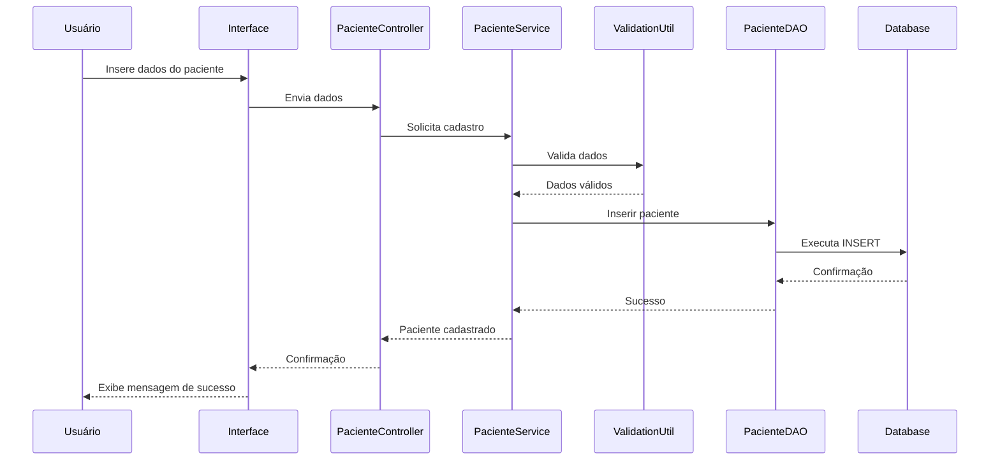
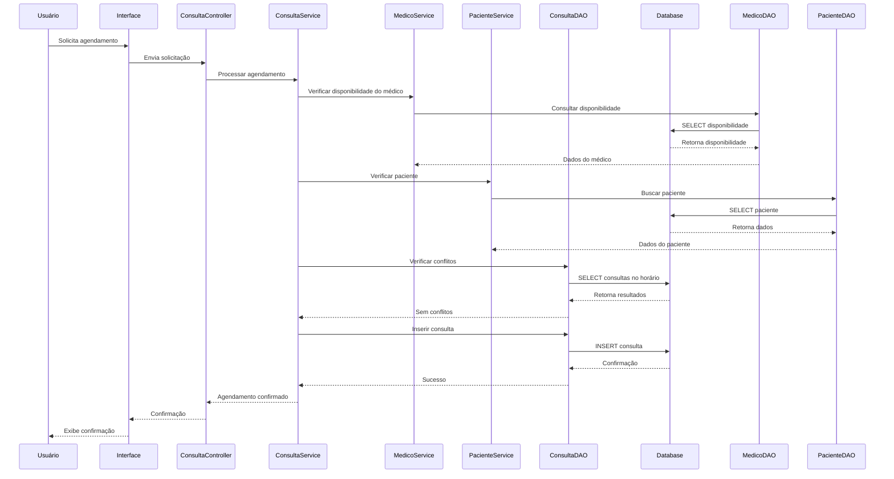
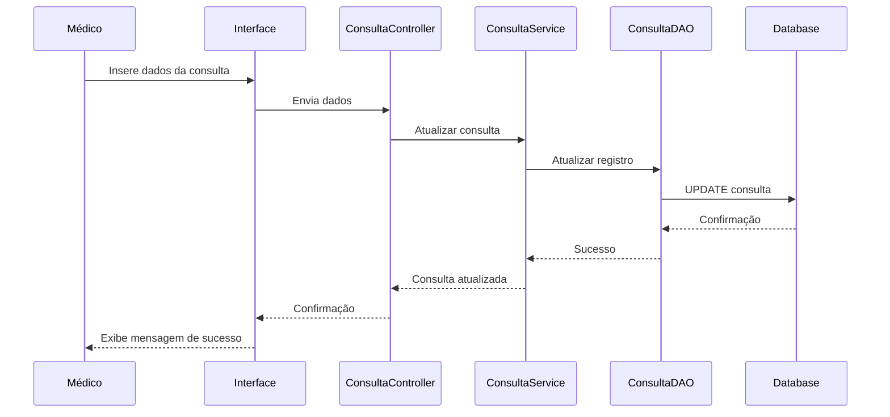
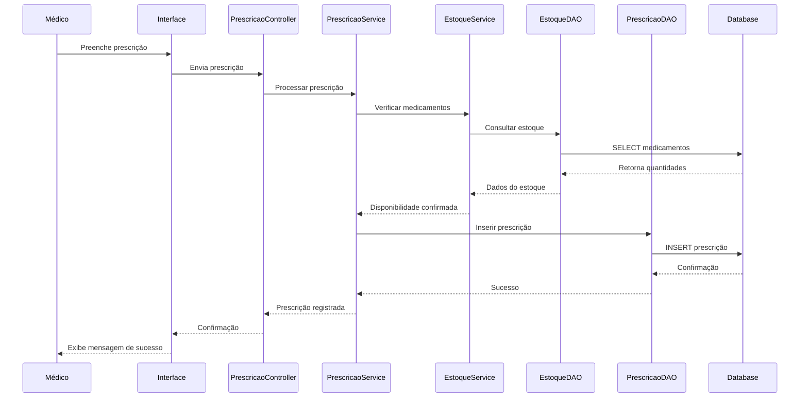
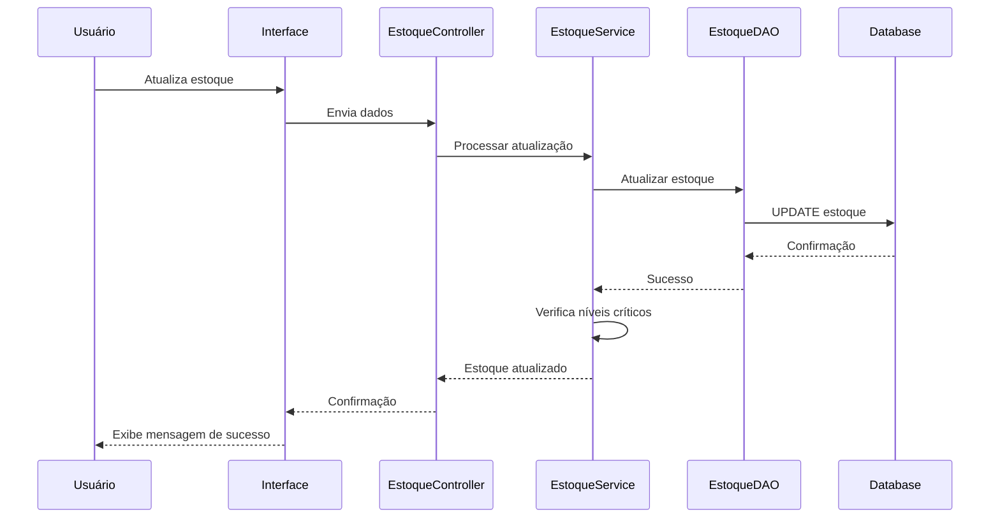
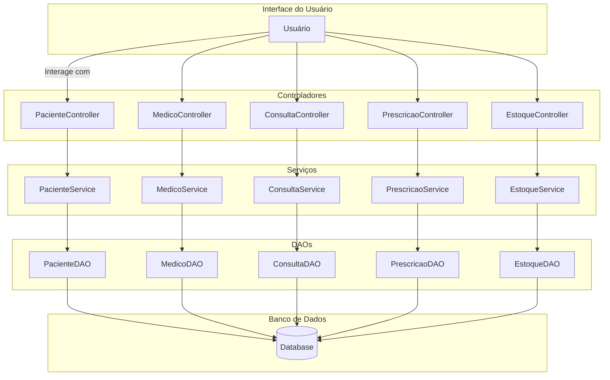

# 1. Visão Geral do Projeto

## Descrição do Projeto

O **Sistema de Gerenciamento de Clínicas e Hospitais** é uma plataforma abrangente desenvolvida para otimizar e modernizar a gestão de instituições de saúde. Alinhado com o **Objetivo de Desenvolvimento Sustentável 3 (ODS 3) - Saúde e Bem-Estar**, o projeto busca aprimorar a eficiência operacional, a qualidade do atendimento ao paciente e facilitar a rotina dos profissionais de saúde.

## Propósito

O propósito principal deste sistema é fornecer uma solução integrada que centraliza todas as informações e processos críticos de uma clínica ou hospital. Ao implementar este sistema, espera-se:

- **Melhoria na gestão de pacientes**, com acesso rápido a históricos médicos e informações essenciais.
- **Otimização do agendamento de consultas**, reduzindo conflitos de horários e aumentando a satisfação dos pacientes.
- **Facilitação na gestão dos profissionais de saúde**, permitindo um controle eficaz sobre especializações e disponibilidades.
- **Aprimoramento na tomada de decisões**, através de relatórios detalhados e análises operacionais.

## Principais Metas

As principais metas do projeto incluem:

### 1. Gerenciamento de Pacientes

- **Armazenamento de Informações Detalhadas**: Registrar dados pessoais, endereços, informações de contato, histórico médico, alergias e medicamentos em uso.
- **Acesso Rápido e Seguro**: Garantir que as informações dos pacientes estejam acessíveis de forma segura para os profissionais autorizados.
  
### 2. Agendamento de Consultas

- **Sistema de Agendamento Eficiente**: Permitir o agendamento de consultas com registro de data, horário, paciente e médico responsável.
- **Opções de Agendamento Online**: Facilitar o processo de marcação para pacientes e funcionários, reduzindo filas e tempo de espera.

### 3. Gerenciamento de Médicos

- **Registro de Profissionais**: Manter dados pessoais, endereços, contatos, especializações e números de registro profissional.
- **Controle de Disponibilidade**: Registrar e visualizar a disponibilidade dos médicos para consultas e procedimentos.

### 4. Especializações Médicas

- **Catalogação de Especialidades**: Registrar as especializações de cada médico.
- **Busca por Especialidade**: Permitir que pacientes e funcionários encontrem médicos com base na especialidade necessária.

### 5. Registros de Consultas

- **Documentação Completa**: Registrar data, hora, paciente, médico, motivo da consulta e observações médicas.
- **Armazenamento de Exames e Prescrições**: Manter resultados de exames, prescrições e recomendações para acompanhamento.

### 6. Funcionalidades Opcionais (Facultativo)

- **Prescrições e Medicamentos**: Emitir prescrições eletrônicas e manter histórico de medicamentos prescritos.
- **Gestão de Estoque de Medicamentos**: Monitorar estoque, consumo e gerar alertas de reabastecimento.
- **Faturamento e Pagamentos**: Integrar registros de procedimentos, gerar faturas e gerenciar contas financeiras.
- **Relatórios e Análises**: Gerar relatórios de desempenho, estatísticas de atendimento e índices de satisfação.

## Envolvimento Profissional

Para assegurar que o sistema atenda às reais necessidades das instituições de saúde, é essencial a colaboração de:

- **Profissionais de Saúde**: Fornecendo insights sobre fluxos de trabalho clínicos e necessidades dos pacientes.
- **Administradores Hospitalares**: Orientando sobre processos operacionais e requisitos administrativos.
- **Especialistas em TI na Área da Saúde**: Garantindo que o sistema seja seguro, compatível com regulamentações e escalável.

## Benefícios Esperados

- **Melhoria na Qualidade do Atendimento**: Com acesso rápido a informações e históricos, os médicos podem oferecer um atendimento mais personalizado e eficaz.
- **Eficiência Operacional**: Processos automatizados reduzem erros, economizam tempo e recursos.
- **Segurança de Dados**: Implementação de protocolos de segurança para proteger informações sensíveis.
- **Decisões Baseadas em Dados**: Relatórios e análises ajudam na identificação de áreas de melhoria e na tomada de decisões estratégicas.

## Conclusão

Este projeto representa um passo significativo na digitalização e modernização de serviços de saúde. Ao integrar diversas funcionalidades em um único sistema, espera-se não apenas melhorar as operações internas das clínicas e hospitais, mas também elevar a satisfação e a experiência dos pacientes.


# 2. Estrutura de Arquivos e Pastas

A seguir, apresentamos um mapa detalhado da organização interna do projeto, explicando a função de cada arquivo e diretório. O projeto foi desenvolvido em Java, seguindo as melhores práticas de organização e estruturação de projetos Java.

## Estrutura Geral do Projeto

```plaintext
hospital-management-system/
├── src/
│   ├── main/
│   │   ├── java/
│   │   │   └── com/
│   │   │       └── hospital/
│   │   │           ├── Main.java
│   │   │           ├── model/
│   │   │           │   ├── Paciente.java
│   │   │           │   ├── Medico.java
│   │   │           │   ├── Consulta.java
│   │   │           │   ├── Especializacao.java
│   │   │           │   ├── Prescricao.java
│   │   │           │   ├── Medicamento.java
│   │   │           │   ├── Estoque.java
│   │   │           │   └── Faturamento.java
│   │   │           ├── dao/
│   │   │           │   ├── PacienteDAO.java
│   │   │           │   ├── MedicoDAO.java
│   │   │           │   ├── ConsultaDAO.java
│   │   │           │   ├── PrescricaoDAO.java
│   │   │           │   ├── MedicamentoDAO.java
│   │   │           │   ├── EstoqueDAO.java
│   │   │           │   └── FaturamentoDAO.java
│   │   │           ├── service/
│   │   │           │   ├── PacienteService.java
│   │   │           │   ├── MedicoService.java
│   │   │           │   ├── ConsultaService.java
│   │   │           │   ├── PrescricaoService.java
│   │   │           │   ├── EstoqueService.java
│   │   │           │   └── FaturamentoService.java
│   │   │           ├── controller/
│   │   │           │   ├── PacienteController.java
│   │   │           │   ├── MedicoController.java
│   │   │           │   ├── ConsultaController.java
│   │   │           │   ├── PrescricaoController.java
│   │   │           │   ├── EstoqueController.java
│   │   │           │   └── FaturamentoController.java
│   │   │           ├── util/
│   │   │           │   ├── DatabaseUtil.java
│   │   │           │   ├── DateUtil.java
│   │   │           │   └── ValidationUtil.java
│   │   │           └── exception/
│   │   │               ├── DataAccessException.java
│   │   │               └── BusinessException.java
│   │   └── resources/
│   │       ├── application.properties
│   │       └── log4j2.xml
│   └── test/
│       └── java/
│           └── com/
│               └── hospital/
│                   ├── model/
│                   │   └── PacienteTest.java
│                   ├── service/
│                   │   └── PacienteServiceTest.java
│                   └── dao/
│                       └── PacienteDAOTest.java
├── lib/
│   └── (bibliotecas externas)
├── sql/
│   ├── schema.sql
│   └── data.sql
├── docs/
│   ├── readme.md
│   ├── diagrama_classes.png
│   └── manual_usuario.pdf
├── pom.xml
├── .gitignore
└── README.md
```

## Descrição Detalhada dos Diretórios e Arquivos

### Diretório `hospital-management-system/`

- **Descrição**: Diretório raiz do projeto que contém todos os subdiretórios e arquivos relacionados ao sistema de gerenciamento hospitalar.

### Diretório `src/`

- **Descrição**: Contém todo o código-fonte do projeto, incluindo código principal e testes.

#### Diretório `src/main/`

- **Descrição**: Contém o código-fonte principal da aplicação.

##### Diretório `src/main/java/`

- **Descrição**: Contém todos os arquivos Java do projeto, organizados por pacote.

###### Diretório `com/hospital/`

- **Descrição**: Pacote base do projeto.

####### Arquivo `Main.java`

- **Descrição**: Classe principal que inicializa a aplicação. Contém o método `main` que inicia o sistema.

###### Diretório `model/`

- **Descrição**: Contém as classes que representam as entidades do sistema (Modelo de Dados).

- **`Paciente.java`**: Classe que representa um paciente, incluindo atributos como nome, data de nascimento, gênero, número de identificação, endereço, informações de contato, histórico médico, alergias e medicamentos em uso.

- **`Medico.java`**: Classe que representa um médico, com atributos como nome, especialização, número de registro, endereço, informações de contato e disponibilidade.

- **`Consulta.java`**: Classe que representa uma consulta médica, incluindo data, hora, paciente, médico responsável, motivo da consulta e observações médicas.

- **`Especializacao.java`**: Classe que representa uma especialização médica, permitindo categorizar os médicos por suas áreas de especialização.

- **`Prescricao.java`**: Classe que representa uma prescrição médica, incluindo medicamentos prescritos, dosagens e instruções de uso.

- **`Medicamento.java`**: Classe que representa um medicamento disponível no estoque, com informações como nome, fabricante, data de validade e quantidade em estoque.

- **`Estoque.java`**: Classe que gerencia o estoque de medicamentos e materiais médicos, incluindo métodos para monitorar o consumo e gerar alertas de reabastecimento.

- **`Faturamento.java`**: Classe que representa o faturamento dos procedimentos médicos, incluindo informações sobre procedimentos realizados, valores, pagamentos recebidos e contas a pagar e receber.

###### Diretório `dao/`

- **Descrição**: Contém as classes de Acesso a Dados (Data Access Objects), responsáveis por interagir com o banco de dados.

- **`PacienteDAO.java`**: Classe responsável por operações CRUD (Create, Read, Update, Delete) relacionadas aos pacientes.

- **`MedicoDAO.java`**: Classe responsável por operações CRUD relacionadas aos médicos.

- **`ConsultaDAO.java`**: Classe responsável por operações CRUD relacionadas às consultas.

- **`PrescricaoDAO.java`**: Classe responsável por operações CRUD relacionadas às prescrições médicas.

- **`MedicamentoDAO.java`**: Classe responsável por operações CRUD relacionadas aos medicamentos.

- **`EstoqueDAO.java`**: Classe responsável por operações CRUD relacionadas ao estoque de medicamentos.

- **`FaturamentoDAO.java`**: Classe responsável por operações CRUD relacionadas ao faturamento e pagamentos.

###### Diretório `service/`

- **Descrição**: Contém as classes de Serviço que implementam a lógica de negócio do sistema.

- **`PacienteService.java`**: Implementa a lógica de negócio relacionada aos pacientes, como validação de dados e regras específicas.

- **`MedicoService.java`**: Implementa a lógica de negócio relacionada aos médicos, incluindo disponibilidade e especializações.

- **`ConsultaService.java`**: Gerencia a lógica de agendamento de consultas, evitando conflitos de horário e verificando a disponibilidade dos médicos.

- **`PrescricaoService.java`**: Implementa a lógica de emissão de prescrições, garantindo que as informações estejam corretas e completas.

- **`EstoqueService.java`**: Gerencia o estoque de medicamentos, monitorando níveis e gerando alertas de reabastecimento.

- **`FaturamentoService.java`**: Implementa a lógica relacionada ao faturamento, como cálculo de valores e registro de pagamentos.

###### Diretório `controller/`

- **Descrição**: Contém as classes Controladoras que interagem com a interface do usuário ou API, recebendo entradas e retornando respostas.

- **`PacienteController.java`**: Controla as operações relacionadas aos pacientes, como cadastro, atualização e consulta de informações.

- **`MedicoController.java`**: Controla as operações relacionadas aos médicos, incluindo gestão de disponibilidade e especializações.

- **`ConsultaController.java`**: Gerencia as operações de agendamento, visualização e cancelamento de consultas.

- **`PrescricaoController.java`**: Controla a emissão e o histórico de prescrições médicas.

- **`EstoqueController.java`**: Gerencia as operações relacionadas ao estoque, como entrada e saída de medicamentos.

- **`FaturamentoController.java`**: Controla as operações de faturamento e pagamentos, incluindo geração de faturas e recibos.

###### Diretório `util/`

- **Descrição**: Contém classes utilitárias e auxiliares que suportam o funcionamento do sistema.

- **`DatabaseUtil.java`**: Fornece métodos para conexão e interação com o banco de dados, como abrir e fechar conexões.

- **`DateUtil.java`**: Fornece métodos para manipulação e formatação de datas e horários.

- **`ValidationUtil.java`**: Contém métodos para validação de dados de entrada, garantindo integridade e consistência.

###### Diretório `exception/`

- **Descrição**: Contém classes de exceção personalizadas para tratamento de erros específicos.

- **`DataAccessException.java`**: Exceção lançada em caso de erros de acesso ao banco de dados.

- **`BusinessException.java`**: Exceção lançada em caso de violação de regras de negócio.

##### Diretório `src/main/resources/`

- **Descrição**: Contém recursos não compilados, como arquivos de configuração e propriedades.

- **`application.properties`**: Arquivo de configuração da aplicação, incluindo parâmetros como URL do banco de dados, credenciais, configurações de log, etc.

- **`log4j2.xml`**: Arquivo de configuração do framework de logging Log4j2, definindo níveis de log e formatos de saída.

#### Diretório `src/test/`

- **Descrição**: Contém o código de teste da aplicação, incluindo testes unitários e de integração.

##### Diretório `src/test/java/`

- **Descrição**: Contém as classes de teste Java, organizadas de forma semelhante ao código-fonte principal.

###### Diretório `com/hospital/`

- **Descrição**: Pacote base para testes.

####### Diretório `model/`

- **`PacienteTest.java`**: Classe que contém testes unitários para a classe `Paciente.java`, verificando a correta criação e manipulação de objetos paciente.

####### Diretório `service/`

- **`PacienteServiceTest.java`**: Classe que testa os métodos de negócio da classe `PacienteService.java`.

####### Diretório `dao/`

- **`PacienteDAOTest.java`**: Classe que testa as operações de acesso a dados relacionadas aos pacientes.

### Diretório `lib/`

- **Descrição**: Contém bibliotecas externas necessárias para o funcionamento do projeto que não são gerenciadas por um sistema de build como Maven ou Gradle.

- **Exemplos de arquivos**: JDBC drivers, bibliotecas de logging, frameworks de teste.

### Diretório `sql/`

- **Descrição**: Contém scripts SQL utilizados para criação e inicialização do banco de dados.

- **`schema.sql`**: Script que define a estrutura do banco de dados, incluindo criação de tabelas, índices e restrições.

- **`data.sql`**: Script que insere dados iniciais no banco de dados, como especializações médicas padrão.

### Diretório `docs/`

- **Descrição**: Contém a documentação do projeto.

- **`readme.md`**: Documentação adicional detalhando aspectos específicos do projeto.

- **`diagrama_classes.png`**: Diagrama UML das classes do sistema, mostrando as relações entre elas.

- **`manual_usuario.pdf`**: Manual do usuário final, explicando como utilizar o sistema.

### Arquivo `pom.xml`

- **Descrição**: Arquivo de configuração do Maven, especificando as dependências do projeto, plugins e configurações de build.

- **Detalhes**:
  - **Dependências**: Especifica bibliotecas externas necessárias, como JDBC, Log4j2, JUnit.
  - **Plugins**: Configura plugins para compilação, testes e empacotamento da aplicação.

### Arquivo `.gitignore`

- **Descrição**: Arquivo que especifica quais arquivos e diretórios devem ser ignorados pelo sistema de controle de versão Git.

- **Conteúdo Comum**:
  - Diretórios de compilação (`/target`, `/build`).
  - Arquivos de configuração da IDE (`.idea/`, `*.iml`).
  - Arquivos de log (`*.log`).
  - Credenciais ou configurações sensíveis.

### Arquivo `README.md`

- **Descrição**: Arquivo principal de documentação do projeto, fornecendo uma visão geral, instruções de instalação, configuração e uso da aplicação.

- **Conteúdo**:
  - **Introdução**: Breve descrição do projeto.
  - **Pré-requisitos**: Softwares e dependências necessárias.
  - **Instalação**: Passos para configurar o ambiente e instalar a aplicação.
  - **Execução**: Instruções para executar o sistema.
  - **Contribuição**: Guia para contribuir com o projeto.
  - **Licença**: Informações sobre a licença do projeto.

---

Essa estrutura detalhada garante uma organização clara e modular do projeto, facilitando o desenvolvimento, manutenção e escalabilidade do sistema de gerenciamento de clínicas ou hospitais. Cada arquivo e diretório tem uma função específica, contribuindo para a robustez e eficiência da aplicação.


# 3. Principais Funcionalidades

## 3.1 Gerenciamento de Pacientes

### Descrição

A funcionalidade de **Gerenciamento de Pacientes** permite à instituição de saúde registrar e manter informações detalhadas sobre os pacientes. Isso inclui dados pessoais, históricos médicos, alergias, medicamentos em uso e outras informações relevantes para o tratamento.

### Funcionalidades Específicas

- **Cadastro de Pacientes**: Permite adicionar novos pacientes ao sistema com informações completas.
- **Atualização de Dados**: Possibilita a edição dos dados do paciente sempre que necessário.
- **Visualização de Histórico Médico**: Acesso ao histórico de consultas, exames, prescrições e tratamentos anteriores.
- **Gerenciamento de Alergias e Medicamentos**: Registro de alergias conhecidas e medicamentos em uso pelo paciente.
- **Busca Avançada de Pacientes**: Localização rápida de pacientes por nome, ID, ou outros critérios.

### Exemplo de Uso

1. **Cadastro de um Novo Paciente**:
   - O recepcionista acessa o módulo de Gerenciamento de Pacientes.
   - Seleciona a opção "Novo Paciente".
   - Insere os dados pessoais: nome, data de nascimento, gênero, número de identificação, endereço e contatos.
   - Adiciona informações médicas relevantes, como histórico médico, alergias e medicamentos atuais.
   - Salva o cadastro, disponibilizando as informações para os profissionais de saúde.

2. **Atualização de Dados do Paciente**:
   - O paciente informa uma mudança de endereço.
   - O atendente localiza o registro do paciente usando a busca avançada.
   - Atualiza o campo de endereço com as novas informações.
   - Salva as alterações, mantendo o registro atualizado.

## 3.2 Agendamento de Consultas

### Descrição

A funcionalidade de **Agendamento de Consultas** permite marcar consultas de forma eficiente, evitando conflitos de horários e garantindo que pacientes e médicos estejam cientes dos compromissos.

### Funcionalidades Específicas

- **Agendamento Manual**: Funcionários podem agendar consultas diretamente pelo sistema.
- **Agendamento Online**: Pacientes podem marcar consultas via portal ou aplicativo.
- **Verificação de Disponibilidade**: O sistema verifica automaticamente a disponibilidade do médico escolhido.
- **Notificações Automáticas**: Envio de lembretes de consultas por e-mail ou SMS.
- **Gestão de Cancelamentos e Remarcações**: Facilidade para alterar ou cancelar consultas agendadas.

### Exemplo de Uso

1. **Agendamento pelo Funcionário**:
   - O paciente liga para marcar uma consulta.
   - O atendente acessa o módulo de Agendamento de Consultas.
   - Seleciona o paciente existente ou cadastra um novo.
   - Escolhe o médico desejado e verifica os horários disponíveis.
   - Agenda a consulta, e o paciente recebe uma confirmação por e-mail.

2. **Agendamento Online pelo Paciente**:
   - O paciente faz login no portal do paciente.
   - Navega até a seção de agendamento.
   - Seleciona a especialidade e o médico preferido.
   - Escolhe um horário disponível no calendário.
   - Confirma a consulta, recebendo uma confirmação instantânea.

## 3.3 Gerenciamento de Médicos

### Descrição

A funcionalidade de **Gerenciamento de Médicos** permite administrar informações sobre os profissionais de saúde, incluindo suas especializações e horários disponíveis.

### Funcionalidades Específicas

- **Cadastro de Médicos**: Registro de novos médicos com informações completas.
- **Atualização de Perfil**: Possibilidade de editar dados pessoais e profissionais.
- **Gestão de Disponibilidade**: Controle dos horários de atendimento e plantões.
- **Associação de Especializações**: Registro das áreas de atuação de cada médico.
- **Consulta de Agenda**: Visualização da agenda de cada médico.

### Exemplo de Uso

1. **Cadastro de um Novo Médico**:
   - O administrador acessa o módulo de Gerenciamento de Médicos.
   - Clica em "Adicionar Médico".
   - Insere os dados pessoais, como nome, CRM, contatos e endereço.
   - Seleciona as especializações do médico.
   - Define a disponibilidade semanal na agenda.
   - Salva o perfil, tornando-o disponível para agendamento.

2. **Atualização de Disponibilidade**:
   - O médico informa uma alteração em seu horário de atendimento.
   - O administrador edita a disponibilidade no sistema.
   - As mudanças são refletidas imediatamente no módulo de agendamento.

## 3.4 Especializações Médicas

### Descrição

A funcionalidade de **Especializações Médicas** facilita a busca e associação de médicos com base em suas áreas de atuação.

### Funcionalidades Específicas

- **Cadastro de Especializações**: Adição de novas especialidades ao sistema.
- **Associação de Médicos a Especialidades**: Ligação entre médicos e suas especializações.
- **Busca por Especialidade**: Localização de médicos disponíveis em determinada área.

### Exemplo de Uso

1. **Associação de Especialização ao Médico**:
   - Durante o cadastro do médico, o administrador seleciona "Cardiologia" como especialização.
   - O médico passa a ser listado nas buscas por cardiologistas.

2. **Busca de Médico por Especialidade**:
   - Um paciente precisa marcar uma consulta com um dermatologista.
   - O atendente utiliza a busca por especialidade.
   - O sistema exibe todos os dermatologistas disponíveis para agendamento.

## 3.5 Registros de Consultas

### Descrição

A funcionalidade de **Registros de Consultas** permite documentar todas as interações médicas com os pacientes, incluindo diagnósticos, tratamentos e observações.

### Funcionalidades Específicas

- **Registro de Dados da Consulta**: Inserção de informações detalhadas sobre cada consulta.
- **Anexos de Exames e Documentos**: Possibilidade de anexar resultados de exames e imagens.
- **Histórico de Consultas**: Acesso rápido ao histórico completo do paciente.
- **Prescrições Médicas**: Emissão de receitas diretamente pelo sistema.

### Exemplo de Uso

1. **Registro de uma Consulta**:
   - Após atender o paciente, o médico acessa o registro da consulta.
   - Insere o motivo da visita, sintomas apresentados e diagnóstico.
   - Anexa resultados de exames realizados.
   - Prescreve medicamentos e salva a consulta.

2. **Consulta ao Histórico Médico**:
   - Antes de uma cirurgia, o médico revisa o histórico do paciente.
   - Verifica alergias, medicamentos em uso e tratamentos anteriores.
   - Utiliza as informações para planejar o procedimento.

## 3.6 Funcionalidades Opcionais

### 3.6.1 Prescrições e Medicamentos

#### Descrição

Permite que os médicos emitam prescrições eletrônicas e mantenham um histórico de medicamentos prescritos a cada paciente.

#### Funcionalidades Específicas

- **Emissão de Prescrições Eletrônicas**: Criação de receitas digitais com assinatura eletrônica.
- **Histórico de Prescrições**: Registro de todas as prescrições emitidas para um paciente.
- **Integração com Farmácias**: Envio automático de prescrições para farmácias parceiras.

#### Exemplo de Uso

- **Emissão de Receita Digital**:
  - O médico prescreve um antibiótico ao paciente.
  - Utiliza o sistema para selecionar o medicamento e a dosagem.
  - A prescrição é gerada e enviada eletronicamente para a farmácia escolhida.
  - O paciente recebe uma notificação com os detalhes.

### 3.6.2 Gestão de Estoque de Medicamentos

#### Descrição

Gerencia o estoque de medicamentos e materiais médicos, garantindo que a clínica ou hospital nunca fique sem suprimentos essenciais.

#### Funcionalidades Específicas

- **Cadastro de Itens de Estoque**: Registro detalhado de medicamentos e materiais.
- **Monitoramento de Níveis de Estoque**: Acompanhamento em tempo real das quantidades disponíveis.
- **Alertas de Reposição**: Notificações automáticas quando o estoque atinge níveis críticos.
- **Relatórios de Consumo**: Análise do uso de medicamentos ao longo do tempo.

#### Exemplo de Uso

- **Alerta de Baixo Estoque**:
  - O sistema detecta que restam poucas unidades de um determinado medicamento.
  - Envia uma notificação ao responsável pelo estoque.
  - Uma ordem de compra é gerada para reposição.

### 3.6.3 Faturamento e Pagamentos

#### Descrição

Integra processos financeiros, facilitando o faturamento de serviços e o acompanhamento de pagamentos.

#### Funcionalidades Específicas

- **Geração de Faturas**: Criação automática de faturas após a prestação de serviços.
- **Registro de Pagamentos**: Atualização do status financeiro dos pacientes.
- **Relatórios Financeiros**: Análises de receitas, despesas e lucros.
- **Integração com Seguradoras**: Envio de faturas e cobranças para planos de saúde.

#### Exemplo de Uso

- **Processamento de Pagamento**:
  - Após a consulta, o sistema gera uma fatura detalhada.
  - O paciente efetua o pagamento na recepção.
  - O pagamento é registrado, e o status financeiro do paciente é atualizado.

### 3.6.4 Relatórios e Análises

#### Descrição

Fornece insights sobre o desempenho da instituição, auxiliando na tomada de decisões estratégicas.

#### Funcionalidades Específicas

- **Relatórios Personalizados**: Criação de relatórios com base em diversos critérios.
- **Análise de Desempenho**: Monitoramento de indicadores-chave (KPIs).
- **Feedback de Pacientes**: Coleta e análise de avaliações dos pacientes.
- **Previsão de Tendências**: Utilização de dados históricos para prever demandas futuras.

#### Exemplo de Uso

- **Relatório Mensal de Atendimentos**:
  - O administrador gera um relatório dos atendimentos realizados no mês.
  - Analisa o número de consultas por especialidade.
  - Identifica a necessidade de contratar mais profissionais em áreas de alta demanda.

---

Cada uma dessas funcionalidades foi projetada para melhorar a eficiência operacional da instituição de saúde, proporcionando um atendimento de qualidade aos pacientes e facilitando o trabalho dos profissionais envolvidos. Os exemplos de uso ilustram situações reais em que o sistema agrega valor ao dia a dia da clínica ou hospital.


# 4. Classes e Métodos

## Visão Geral

O sistema de gerenciamento de clínicas e hospitais foi desenvolvido em Java, seguindo uma arquitetura em camadas que separa claramente as responsabilidades de cada componente. As principais camadas são:

- **Model (Modelo)**: Classes que representam as entidades do sistema.
- **DAO (Data Access Object)**: Classes responsáveis pela interação com o banco de dados.
- **Service (Serviço)**: Implementa a lógica de negócio do sistema.
- **Controller (Controlador)**: Lida com a comunicação entre a interface do usuário (ou API) e a camada de serviço.
- **Util (Utilitários)**: Fornece classes auxiliares e funções utilitárias.
- **Exception (Exceções)**: Define exceções personalizadas para tratamento de erros.

A seguir, apresentamos uma descrição detalhada das principais classes e métodos de cada camada, incluindo suas responsabilidades e interações.

---

## 4.1 Camada Model (Modelo)

As classes da camada Model representam as entidades fundamentais do sistema. Elas contêm atributos que refletem os dados armazenados e métodos básicos para acesso e manipulação desses dados.

### 4.1.1 Classe `Paciente`

**Responsabilidade**: Representa um paciente no sistema, armazenando informações pessoais e médicas.

**Principais Atributos**:

- `int id`: Identificador único do paciente.
- `String nome`: Nome completo.
- `Date dataNascimento`: Data de nascimento.
- `String genero`: Gênero do paciente.
- `String cpf`: Número de identificação (CPF).
- `String endereco`: Endereço residencial.
- `String telefone`: Número de telefone.
- `String email`: Endereço de e-mail.
- `String historicoMedico`: Histórico médico detalhado.
- `List<String> alergias`: Lista de alergias conhecidas.
- `List<String> medicamentosEmUso`: Lista de medicamentos que o paciente está utilizando.

**Principais Métodos**:

- `getters` e `setters` para cada atributo.
- `String getIdade()`: Calcula e retorna a idade atual do paciente.
- `void adicionarAlergia(String alergia)`: Adiciona uma alergia à lista.
- `void removerAlergia(String alergia)`: Remove uma alergia da lista.
- `void adicionarMedicamento(String medicamento)`: Adiciona um medicamento à lista.
- `void removerMedicamento(String medicamento)`: Remove um medicamento da lista.

**Interações**:

- Interage com `Consulta` para vincular consultas ao paciente.
- Utilizada por `PacienteDAO` para operações de persistência.

---

### 4.1.2 Classe `Medico`

**Responsabilidade**: Representa um médico, armazenando informações pessoais, profissionais e disponibilidade.

**Principais Atributos**:

- `int id`: Identificador único do médico.
- `String nome`: Nome completo.
- `String crm`: Número de registro profissional.
- `String especializacao`: Especialização médica.
- `String endereco`: Endereço residencial ou profissional.
- `String telefone`: Contato telefônico.
- `String email`: Endereço de e-mail.
- `List<HorarioDisponivel> disponibilidade`: Lista de horários disponíveis para consultas.

**Principais Métodos**:

- `getters` e `setters` para cada atributo.
- `void adicionarDisponibilidade(HorarioDisponivel horario)`: Adiciona um horário à lista de disponibilidade.
- `void removerDisponibilidade(HorarioDisponivel horario)`: Remove um horário da lista.

**Interações**:

- Interage com `Consulta` para vincular consultas ao médico.
- Utilizada por `MedicoDAO` para operações de persistência.

---

### 4.1.3 Classe `Consulta`

**Responsabilidade**: Representa uma consulta médica agendada ou realizada.

**Principais Atributos**:

- `int id`: Identificador único da consulta.
- `Paciente paciente`: Paciente que será atendido.
- `Medico medico`: Médico responsável pelo atendimento.
- `Date dataHora`: Data e hora da consulta.
- `String motivo`: Motivo da consulta.
- `String observacoes`: Observações e anotações médicas.

**Principais Métodos**:

- `getters` e `setters` para cada atributo.
- `boolean isAgendada()`: Verifica se a consulta está agendada ou já foi realizada.
- `void adicionarObservacao(String observacao)`: Adiciona uma observação à consulta.

**Interações**:

- Associa `Paciente` e `Medico` por meio de objetos dessas classes.
- Utilizada por `ConsultaDAO` para operações de persistência.

---

### 4.1.4 Classe `Prescricao`

**Responsabilidade**: Representa uma prescrição médica emitida durante uma consulta.

**Principais Atributos**:

- `int id`: Identificador único da prescrição.
- `Consulta consulta`: Consulta na qual a prescrição foi emitida.
- `List<MedicamentoPrescrito> medicamentos`: Lista de medicamentos prescritos, incluindo dosagens e instruções.

**Principais Métodos**:

- `getters` e `setters` para cada atributo.
- `void adicionarMedicamento(MedicamentoPrescrito medicamento)`: Adiciona um medicamento à prescrição.
- `void removerMedicamento(MedicamentoPrescrito medicamento)`: Remove um medicamento da prescrição.

**Interações**:

- Associada a uma `Consulta`.
- Utiliza `MedicamentoPrescrito` para detalhar cada medicamento.
- Persistida através de `PrescricaoDAO`.

---

### 4.1.5 Classe `MedicamentoPrescrito`

**Responsabilidade**: Representa um medicamento prescrito, incluindo detalhes como dosagem e instruções.

**Principais Atributos**:

- `int id`: Identificador único.
- `String nome`: Nome do medicamento.
- `String dosagem`: Dosagem prescrita.
- `String instrucoes`: Instruções de uso.

**Principais Métodos**:

- `getters` e `setters` para cada atributo.

**Interações**:

- Utilizada dentro de `Prescricao`.

---

### 4.1.6 Classe `Estoque`

**Responsabilidade**: Gerencia o estoque de medicamentos e materiais médicos.

**Principais Atributos**:

- `Map<String, Integer> itens`: Mapa de itens (nome do medicamento/material) e suas quantidades em estoque.

**Principais Métodos**:

- `void adicionarItem(String nome, int quantidade)`: Adiciona quantidade de um item ao estoque.
- `void removerItem(String nome, int quantidade)`: Remove quantidade de um item do estoque.
- `int verificarQuantidade(String nome)`: Retorna a quantidade disponível de um item.
- `List<String> listarItensBaixoEstoque()`: Retorna uma lista de itens com estoque abaixo do nível crítico.

**Interações**:

- Utilizada por `EstoqueService` para lógica de negócio.
- Pode interagir com `MedicamentoPrescrito` para atualizar o estoque após uma prescrição.

---

## 4.2 Camada DAO (Data Access Object)

As classes DAO são responsáveis pela comunicação com o banco de dados, executando operações de persistência.

### 4.2.1 Classe `PacienteDAO`

**Responsabilidade**: Realiza operações de CRUD (Create, Read, Update, Delete) para objetos `Paciente`.

**Principais Métodos**:

- `void inserir(Paciente paciente)`: Insere um novo paciente no banco de dados.
- `Paciente buscarPorId(int id)`: Recupera um paciente pelo ID.
- `List<Paciente> buscarTodos()`: Retorna uma lista de todos os pacientes.
- `void atualizar(Paciente paciente)`: Atualiza os dados de um paciente existente.
- `void deletar(int id)`: Remove um paciente do banco de dados.

**Interações**:

- Utiliza `DatabaseUtil` para obter conexões com o banco de dados.
- Chamado por `PacienteService` para acessar dados.

---

### 4.2.2 Classe `MedicoDAO`

**Responsabilidade**: Realiza operações de CRUD para objetos `Medico`.

**Principais Métodos**:

- `void inserir(Medico medico)`: Insere um novo médico no banco de dados.
- `Medico buscarPorId(int id)`: Recupera um médico pelo ID.
- `List<Medico> buscarTodos()`: Retorna uma lista de todos os médicos.
- `void atualizar(Medico medico)`: Atualiza os dados de um médico existente.
- `void deletar(int id)`: Remove um médico do banco de dados.

**Interações**:

- Interage com o banco de dados através de `DatabaseUtil`.
- Chamado por `MedicoService`.

---

### 4.2.3 Classe `ConsultaDAO`

**Responsabilidade**: Gerencia operações de persistência para `Consulta`.

**Principais Métodos**:

- `void inserir(Consulta consulta)`: Insere uma nova consulta.
- `Consulta buscarPorId(int id)`: Busca uma consulta pelo ID.
- `List<Consulta> buscarPorPaciente(int pacienteId)`: Busca consultas de um paciente específico.
- `List<Consulta> buscarPorMedico(int medicoId)`: Busca consultas de um médico específico.
- `void atualizar(Consulta consulta)`: Atualiza os dados de uma consulta.
- `void deletar(int id)`: Remove uma consulta.

**Interações**:

- Utiliza `DatabaseUtil` para conexões.
- Interage com `Paciente` e `Medico` para obter informações relacionadas.

---

### 4.2.4 Classe `PrescricaoDAO`

**Responsabilidade**: Gerencia a persistência de `Prescricao`.

**Principais Métodos**:

- `void inserir(Prescricao prescricao)`: Insere uma nova prescrição.
- `Prescricao buscarPorId(int id)`: Recupera uma prescrição pelo ID.
- `List<Prescricao> buscarPorConsulta(int consultaId)`: Recupera prescrições de uma consulta específica.
- `void atualizar(Prescricao prescricao)`: Atualiza uma prescrição.
- `void deletar(int id)`: Remove uma prescrição.

**Interações**:

- Interage com `ConsultaDAO` para garantir a integridade referencial.
- Utiliza `DatabaseUtil` para acesso ao banco.

---

## 4.3 Camada Service (Serviço)

As classes de serviço contêm a lógica de negócio do sistema, aplicando regras e validações.

### 4.3.1 Classe `PacienteService`

**Responsabilidade**: Gerencia as operações relacionadas a pacientes, aplicando regras de negócio.

**Principais Métodos**:

- `void cadastrarPaciente(Paciente paciente)`: Valida e cadastra um novo paciente.
- `Paciente obterPaciente(int id)`: Recupera um paciente, aplicando regras de acesso.
- `List<Paciente> listarPacientes()`: Lista todos os pacientes.
- `void atualizarPaciente(Paciente paciente)`: Valida e atualiza os dados de um paciente.
- `void removerPaciente(int id)`: Verifica se o paciente pode ser removido e realiza a exclusão.

**Interações**:

- Chama `PacienteDAO` para operações de persistência.
- Pode lançar `BusinessException` em caso de violação de regras de negócio.

---

### 4.3.2 Classe `MedicoService`

**Responsabilidade**: Gerencia operações relacionadas aos médicos.

**Principais Métodos**:

- `void cadastrarMedico(Medico medico)`: Valida e cadastra um novo médico.
- `Medico obterMedico(int id)`: Recupera informações de um médico.
- `List<Medico> listarMedicos()`: Lista todos os médicos.
- `void atualizarMedico(Medico medico)`: Atualiza dados do médico.
- `void removerMedico(int id)`: Remove um médico após verificar dependências.

**Interações**:

- Chama `MedicoDAO` para persistência.
- Interage com `ConsultaService` para verificar agendamentos.

---

### 4.3.3 Classe `ConsultaService`

**Responsabilidade**: Gerencia o agendamento e registro de consultas.

**Principais Métodos**:

- `void agendarConsulta(Consulta consulta)`: Valida disponibilidade e agenda uma consulta.
- `Consulta obterConsulta(int id)`: Recupera detalhes de uma consulta.
- `List<Consulta> listarConsultasPorPaciente(int pacienteId)`: Lista consultas de um paciente.
- `void atualizarConsulta(Consulta consulta)`: Atualiza informações da consulta.
- `void cancelarConsulta(int id)`: Cancela uma consulta agendada.

**Interações**:

- Verifica disponibilidade de `Medico` e `Paciente`.
- Chama `ConsultaDAO` para persistência.
- Pode enviar notificações (via `NotificationService`, se existente).

---

### 4.3.4 Classe `PrescricaoService`

**Responsabilidade**: Gerencia a emissão e registro de prescrições médicas.

**Principais Métodos**:

- `void emitirPrescricao(Prescricao prescricao)`: Valida e registra uma nova prescrição.
- `Prescricao obterPrescricao(int id)`: Recupera uma prescrição específica.
- `List<Prescricao> listarPrescricoesPorPaciente(int pacienteId)`: Lista prescrições de um paciente.
- `void atualizarPrescricao(Prescricao prescricao)`: Atualiza os detalhes de uma prescrição.
- `void removerPrescricao(int id)`: Remove uma prescrição existente.

**Interações**:

- Chama `PrescricaoDAO` para persistência.
- Interage com `EstoqueService` para verificar disponibilidade de medicamentos.

---

### 4.3.5 Classe `EstoqueService`

**Responsabilidade**: Gerencia o estoque de medicamentos, monitorando níveis e reposições.

**Principais Métodos**:

- `void adicionarItemEstoque(String nome, int quantidade)`: Adiciona itens ao estoque.
- `void consumirItemEstoque(String nome, int quantidade)`: Consome itens do estoque.
- `int verificarQuantidadeEstoque(String nome)`: Verifica quantidade disponível.
- `List<String> obterItensBaixoEstoque()`: Retorna lista de itens com estoque crítico.

**Interações**:

- Utiliza `Estoque` para manipulação dos dados.
- Pode enviar alertas de baixo estoque (via `NotificationService`).

---

## 4.4 Camada Controller (Controlador)

Os controladores lidam com a interação entre a interface do usuário ou API e a camada de serviço.

### 4.4.1 Classe `PacienteController`

**Responsabilidade**: Controla as operações relacionadas a pacientes.

**Principais Métodos**:

- `String cadastrarPaciente(HttpServletRequest request)`: Recebe dados do paciente, chama `PacienteService` e retorna uma resposta.
- `String visualizarPaciente(int id)`: Obtém detalhes de um paciente e os apresenta.
- `String atualizarPaciente(HttpServletRequest request)`: Atualiza informações do paciente.
- `String removerPaciente(int id)`: Remove um paciente do sistema.

**Interações**:

- Chama `PacienteService` para lógica de negócio.
- Processa dados de entrada e saída para a interface.

---

### 4.4.2 Classe `MedicoController`

**Responsabilidade**: Controla operações relacionadas aos médicos.

**Principais Métodos**:

- `String cadastrarMedico(HttpServletRequest request)`: Registra um novo médico.
- `String visualizarMedico(int id)`: Apresenta detalhes de um médico.
- `String atualizarMedico(HttpServletRequest request)`: Atualiza dados do médico.
- `String removerMedico(int id)`: Remove um médico do sistema.

**Interações**:

- Chama `MedicoService`.
- Interage com a interface para entrada e saída de dados.

---

### 4.4.3 Classe `ConsultaController`

**Responsabilidade**: Gerencia as operações de agendamento e visualização de consultas.

**Principais Métodos**:

- `String agendarConsulta(HttpServletRequest request)`: Recebe dados para agendamento e processa a solicitação.
- `String visualizarConsulta(int id)`: Exibe detalhes de uma consulta.
- `String atualizarConsulta(HttpServletRequest request)`: Atualiza informações da consulta.
- `String cancelarConsulta(int id)`: Processa o cancelamento de uma consulta.

**Interações**:

- Chama `ConsultaService`.
- Pode interagir com `PacienteController` e `MedicoController` para obter informações adicionais.

---

## 4.5 Camada Util (Utilitários)

Contém classes auxiliares que fornecem funcionalidades de suporte.

### 4.5.1 Classe `DatabaseUtil`

**Responsabilidade**: Gerencia conexões com o banco de dados.

**Principais Métodos**:

- `Connection getConnection()`: Estabelece e retorna uma conexão com o banco de dados.
- `void closeConnection(Connection conn)`: Fecha uma conexão existente.
- `void closeResources(Statement stmt, ResultSet rs)`: Fecha recursos utilizados nas operações.

**Interações**:

- Utilizada por todas as classes DAO.

---

### 4.5.2 Classe `DateUtil`

**Responsabilidade**: Fornece métodos para manipulação de datas.

**Principais Métodos**:

- `Date stringToDate(String dataString)`: Converte uma `String` para um objeto `Date`.
- `String dateToString(Date data)`: Converte um objeto `Date` para `String` formatada.
- `int calcularIdade(Date dataNascimento)`: Calcula a idade a partir da data de nascimento.

**Interações**:

- Utilizada por classes que lidam com datas, como `Paciente` e `Consulta`.

---

### 4.5.3 Classe `ValidationUtil`

**Responsabilidade**: Contém métodos para validação de dados de entrada.

**Principais Métodos**:

- `boolean isCPFValido(String cpf)`: Verifica se o CPF é válido.
- `boolean isEmailValido(String email)`: Verifica se o e-mail tem um formato válido.
- `boolean isDataFutura(Date data)`: Verifica se a data informada é futura.
- `void validarPaciente(Paciente paciente)`: Executa várias validações nos dados do paciente.

**Interações**:

- Utilizada pelas classes de serviço antes de operações críticas.

---

## 4.6 Camada Exception (Exceções)

Define exceções personalizadas para tratamento de erros específicos.

### 4.6.1 Classe `DataAccessException`

**Responsabilidade**: Exceção lançada em caso de erros ao acessar o banco de dados.

**Principais Construtores**:

- `DataAccessException(String mensagem)`: Cria uma exceção com uma mensagem específica.
- `DataAccessException(String mensagem, Throwable causa)`: Cria uma exceção com mensagem e causa.

**Interações**:

- Lançada pelas classes DAO.
- Capturada pelas classes de serviço ou controladores.

---

### 4.6.2 Classe `BusinessException`

**Responsabilidade**: Exceção lançada quando ocorre uma violação de regras de negócio.

**Principais Construtores**:

- `BusinessException(String mensagem)`: Cria uma exceção com uma mensagem específica.
- `BusinessException(String mensagem, Throwable causa)`: Cria uma exceção com mensagem e causa.

**Interações**:

- Lançada pelas classes de serviço.
- Capturada pelos controladores para apresentar mensagens ao usuário.

---

## 4.7 Fluxo de Interações

Para ilustrar as interações entre as classes, vamos descrever o fluxo de uma operação comum: **Agendamento de uma Consulta**.

1. **O usuário (paciente ou atendente) solicita o agendamento de uma consulta** através da interface do usuário.

2. **`ConsultaController.agendarConsulta(HttpServletRequest request)`**:
   - Recebe os dados da solicitação.
   - Extrai informações como pacienteId, medicoId, data e hora desejadas.

3. **`ConsultaService.agendarConsulta(Consulta consulta)`**:
   - Recebe o objeto `Consulta` com os dados preenchidos.
   - **Validações**:
     - Verifica se o paciente existe (`PacienteService.obterPaciente(int id)`).
     - Verifica se o médico existe e está disponível (`MedicoService.obterMedico(int id)`).
     - Verifica se o horário não está ocupado (`ConsultaDAO.buscarPorMedicoEData(medicoId, dataHora)`).
   - **Regras de Negócio**:
     - Não permitir agendamento em datas passadas.
     - Limitar o número de consultas por dia para um médico.
   - Em caso de sucesso, prossegue para persistência.
   - Em caso de erro, lança `BusinessException`.

4. **`ConsultaDAO.inserir(Consulta consulta)`**:
   - Executa a operação de inserção no banco de dados.
   - Em caso de falha na conexão ou execução, lança `DataAccessException`.

5. **Resposta ao Usuário**:
   - Se tudo ocorrer bem, o controlador retorna uma mensagem de sucesso.
   - Se ocorrer uma exceção, o controlador captura e apresenta uma mensagem de erro amigável.

---

## 4.8 Diagrama de Classes

Para uma melhor visualização das relações entre as classes, consulte o diagrama de classes disponível em `docs/diagrama_classes.png`.

---

## Conclusão

A organização das classes e métodos foi cuidadosamente planejada para garantir a coesão e o baixo acoplamento entre os componentes do sistema. Cada classe possui responsabilidades bem definidas, facilitando a manutenção e a escalabilidade do sistema. As interações entre as classes seguem os princípios da orientação a objetos, promovendo reutilização e flexibilidade.


# 5. Fluxos de Dados

## Introdução

Nesta seção, apresentaremos os fluxos de dados principais do sistema de gerenciamento de clínicas e hospitais. Os diagramas ilustram como os dados fluem através dos diferentes componentes do sistema durante as operações críticas. Utilizaremos a Linguagem de Modelagem Unificada (UML) para representar esses fluxos, empregando o Mermaid para os diagramas, que podem ser renderizados diretamente em Markdown.

Os principais fluxos de dados que serão detalhados são:

- **Cadastro de Paciente**
- **Agendamento de Consulta**
- **Registro de Consulta Médica**
- **Emissão de Prescrição Médica**
- **Atualização de Estoque de Medicamentos**

---

## 5.1 Cadastro de Paciente

### Descrição do Fluxo

O fluxo de cadastro de paciente envolve a entrada de dados pessoais e médicos do paciente no sistema, que são então processados e armazenados no banco de dados. Esse processo garante que todas as informações relevantes estejam disponíveis para futuras consultas e tratamentos.

### Fluxo de Dados

1. **Usuário (Atendente/Recepcionista)**: Inicia o processo de cadastro fornecendo os dados do paciente através da interface do sistema.
2. **Interface do Usuário**: Coleta os dados inseridos e os envia para o `PacienteController`.
3. **PacienteController**: Recebe os dados e chama o `PacienteService` para processar o cadastro.
4. **PacienteService**: Valida os dados utilizando `ValidationUtil` e, em caso de sucesso, solicita ao `PacienteDAO` que persista as informações.
5. **PacienteDAO**: Interage com o banco de dados através do `DatabaseUtil` para inserir os dados do paciente.
6. **Banco de Dados**: Armazena as informações do paciente.
7. **Confirmação**: O fluxo retorna com a confirmação de sucesso ou mensagens de erro, que são apresentadas ao usuário.

### Diagrama de Fluxo de Dados



---

## 5.2 Agendamento de Consulta

### Descrição do Fluxo

O agendamento de consulta permite que pacientes marquem consultas com médicos disponíveis. O fluxo garante que não haja conflitos de horário e que o médico escolhido esteja disponível.

### Fluxo de Dados

1. **Usuário (Paciente/Atendente)**: Solicita o agendamento através da interface.
2. **Interface do Usuário**: Envia a solicitação para o `ConsultaController`.
3. **ConsultaController**: Recebe os dados e chama o `ConsultaService`.
4. **ConsultaService**: Verifica a disponibilidade do médico e do paciente, e valida os dados.
5. **ConsultaDAO**: Consulta o banco de dados para verificar conflitos de horário.
6. **Banco de Dados**: Retorna informações sobre agendamentos existentes.
7. **ConsultaService**: Confirma a possibilidade de agendamento e solicita ao `ConsultaDAO` que insira a nova consulta.
8. **ConsultaDAO**: Insere a consulta no banco de dados.
9. **Banco de Dados**: Armazena o agendamento.
10. **Confirmação**: O fluxo retorna com a confirmação do agendamento.

### Diagrama de Fluxo de Dados



---

## 5.3 Registro de Consulta Médica

### Descrição do Fluxo

Após a realização de uma consulta, o médico registra as informações relevantes, incluindo diagnósticos, procedimentos realizados e observações.

### Fluxo de Dados

1. **Usuário (Médico)**: Acessa o registro da consulta pela interface.
2. **Interface do Usuário**: Envia as informações para o `ConsultaController`.
3. **ConsultaController**: Recebe os dados e chama o `ConsultaService`.
4. **ConsultaService**: Valida as informações e atualiza o registro da consulta.
5. **ConsultaDAO**: Atualiza os dados da consulta no banco de dados.
6. **Banco de Dados**: Armazena as informações atualizadas.
7. **Confirmação**: Retorna a confirmação da atualização ao usuário.

### Diagrama de Fluxo de Dados



---

## 5.4 Emissão de Prescrição Médica

### Descrição do Fluxo

O médico emite uma prescrição para o paciente durante ou após a consulta. A prescrição é registrada no sistema e pode ser acessada posteriormente.

### Fluxo de Dados

1. **Usuário (Médico)**: Preenche a prescrição na interface do sistema.
2. **Interface do Usuário**: Envia os dados para o `PrescricaoController`.
3. **PrescricaoController**: Recebe os dados e chama o `PrescricaoService`.
4. **PrescricaoService**: Valida os dados e verifica o estoque dos medicamentos.
5. **EstoqueService**: Verifica a disponibilidade dos medicamentos prescritos.
6. **EstoqueDAO**: Consulta o banco de dados para verificar quantidades.
7. **Banco de Dados**: Retorna informações sobre o estoque.
8. **PrescricaoService**: Registra a prescrição no sistema através do `PrescricaoDAO`.
9. **PrescricaoDAO**: Insere a prescrição no banco de dados.
10. **Banco de Dados**: Armazena a prescrição.
11. **Confirmação**: Retorna a confirmação ao médico.

### Diagrama de Fluxo de Dados



---

## 5.5 Atualização de Estoque de Medicamentos

### Descrição do Fluxo

Quando medicamentos são consumidos ou recebidos, o estoque precisa ser atualizado para refletir as quantidades atuais e garantir que não faltem suprimentos essenciais.

### Fluxo de Dados

1. **Usuário (Farmacêutico/Responsável pelo Estoque)**: Realiza a entrada ou saída de medicamentos através da interface.
2. **Interface do Usuário**: Envia a informação para o `EstoqueController`.
3. **EstoqueController**: Recebe os dados e chama o `EstoqueService`.
4. **EstoqueService**: Processa a atualização do estoque.
5. **EstoqueDAO**: Atualiza as quantidades no banco de dados.
6. **Banco de Dados**: Armazena as novas quantidades.
7. **Alerta de Reposição**: Se necessário, o `EstoqueService` gera um alerta para reposição.
8. **Confirmação**: Retorna ao usuário a confirmação da operação.

### Diagrama de Fluxo de Dados



---

## 5.6 Fluxo Geral de Dados no Sistema

### Descrição do Fluxo

Este diagrama representa uma visão geral de como os dados fluem entre os principais componentes do sistema durante diversas operações.

### Diagrama de Fluxo de Dados Geral



---

## Conclusão

Os fluxos de dados apresentados demonstram como as informações percorrem o sistema desde a interação inicial do usuário até a persistência no banco de dados e retorno de confirmações ou resultados. A compreensão desses fluxos é essencial para:

- **Desenvolvedores**: Para manutenção, depuração e evolução do sistema.
- **Administradores de Sistemas**: Para otimização de desempenho e escalabilidade.
- **Usuários Finais**: Para entendimento de como suas ações impactam o sistema.

A modelagem clara dos fluxos de dados ajuda a garantir que todos os componentes do sistema trabalhem de forma harmoniosa, proporcionando um serviço eficiente e confiável.


# 6. Requisitos de Implementação

## Introdução

Esta seção fornece instruções detalhadas sobre como configurar e executar o **Sistema de Gerenciamento de Clínicas e Hospitais** em um ambiente de desenvolvimento. Inclui os pré-requisitos, passos para configuração, execução do projeto e dicas para solução de problemas.

## 6.1 Pré-requisitos

Antes de iniciar a configuração, certifique-se de que o seu ambiente atenda aos seguintes requisitos:

### 6.1.1 Software Necessário

- **Java Development Kit (JDK) 11 ou superior**: Necessário para compilar e executar o projeto Java.
- **Apache Maven 3.6 ou superior**: Utilizado para gerenciamento de dependências e construção do projeto.
- **Banco de Dados Relacional**: MySQL 8.0 ou PostgreSQL 12.0 (ou superior) para armazenamento de dados.
- **IDE Java (Opcional, mas recomendado)**: IntelliJ IDEA, Eclipse ou NetBeans para facilitar o desenvolvimento.
- **Git**: Para clonar o repositório do projeto, se necessário.

### 6.1.2 Recursos do Sistema

- **Memória RAM**: Mínimo de 4 GB.
- **Espaço em Disco**: Pelo menos 500 MB disponíveis para o projeto e dependências.
- **Sistema Operacional**: Windows 10 ou superior, macOS Catalina ou superior, Linux Ubuntu 18.04 ou superior.

## 6.2 Configuração do Ambiente

### 6.2.1 Instalação do JDK

1. **Download do JDK**:
   - Acesse o site oficial da Oracle ([https://www.oracle.com/java/technologies/javase-jdk11-downloads.html](https://www.oracle.com/java/technologies/javase-jdk11-downloads.html)) ou utilize o OpenJDK ([https://jdk.java.net/11/](https://jdk.java.net/11/)).

2. **Instalação**:
   - Siga as instruções de instalação para o seu sistema operacional.

3. **Configuração da Variável de Ambiente**:
   - Configure a variável `JAVA_HOME` apontando para o diretório de instalação do JDK.
   - Adicione `%JAVA_HOME%/bin` ao `PATH` do sistema.

4. **Verificação da Instalação**:
   - Abra o terminal ou prompt de comando e execute:

     ```bash
     java -version
     ```

     - A saída deve exibir a versão do Java instalada.

### 6.2.2 Instalação do Apache Maven

1. **Download do Maven**:
   - Baixe a versão mais recente do Maven em [https://maven.apache.org/download.cgi](https://maven.apache.org/download.cgi).

2. **Instalação**:
   - Extraia o arquivo em um diretório de sua preferência.

3. **Configuração da Variável de Ambiente**:
   - Configure a variável `MAVEN_HOME` apontando para o diretório de instalação do Maven.
   - Adicione `%MAVEN_HOME%/bin` ao `PATH` do sistema.

4. **Verificação da Instalação**:
   - No terminal, execute:

     ```bash
     mvn -version
     ```

     - Deve exibir a versão do Maven instalada.

### 6.2.3 Instalação do Banco de Dados

#### MySQL

1. **Download e Instalação**:
   - Baixe o MySQL Community Server em [https://dev.mysql.com/downloads/mysql/](https://dev.mysql.com/downloads/mysql/).
   - Siga as instruções de instalação.

2. **Configuração**:
   - Defina uma senha para o usuário `root` durante a instalação.
   - Certifique-se de que o serviço do MySQL está em execução.

#### PostgreSQL (Alternativa)

1. **Download e Instalação**:
   - Baixe o PostgreSQL em [https://www.postgresql.org/download/](https://www.postgresql.org/download/).
   - Siga as instruções de instalação.

2. **Configuração**:
   - Defina uma senha para o usuário `postgres`.
   - Certifique-se de que o serviço do PostgreSQL está em execução.

### 6.2.4 Instalação da IDE (Opcional)

- **IntelliJ IDEA**:
  - Baixe em [https://www.jetbrains.com/idea/download/](https://www.jetbrains.com/idea/download/).
  - Recomenda-se a versão Community (gratuita).

- **Eclipse**:
  - Baixe em [https://www.eclipse.org/downloads/](https://www.eclipse.org/downloads/).

- **NetBeans**:
  - Baixe em [https://netbeans.apache.org/download/index.html](https://netbeans.apache.org/download/index.html).

## 6.3 Configuração do Projeto

### 6.3.1 Clonando o Repositório

1. **Usando Git**:
   - Abra o terminal e execute:

     ```bash
     git clone https://github.com/seu-usuario/hospital-management-system.git
     ```

2. **Download do Código-Fonte**:
   - Se não utilizar Git, baixe o código-fonte como um arquivo ZIP pelo GitHub e extraia em um diretório.

### 6.3.2 Importando o Projeto na IDE

1. **Abrir a IDE**:
   - Inicie a sua IDE Java preferida.

2. **Importar Projeto Maven**:
   - Selecione a opção para importar um projeto existente.
   - Navegue até o diretório `hospital-management-system/` e selecione o arquivo `pom.xml`.

3. **Configuração Automática**:
   - A IDE deve detectar o projeto Maven e configurar o classpath e as dependências automaticamente.

### 6.3.3 Configuração do Banco de Dados

1. **Criar o Banco de Dados**:
   - Abra o terminal ou um cliente SQL (como MySQL Workbench ou pgAdmin).
   - Execute o seguinte comando para criar o banco de dados:

     ```sql
     CREATE DATABASE hospital_db;
     ```

2. **Criar Usuário (Opcional)**:
   - Para maior segurança, crie um usuário específico para a aplicação:

     ```sql
     CREATE USER 'hospital_user'@'localhost' IDENTIFIED BY 'sua_senha';
     GRANT ALL PRIVILEGES ON hospital_db.* TO 'hospital_user'@'localhost';
     FLUSH PRIVILEGES;
     ```

### 6.3.4 Configuração do Arquivo `application.properties`

1. **Localizar o Arquivo**:
   - Navegue até `src/main/resources/application.properties`.

2. **Editar as Propriedades**:
   - Configure as informações de conexão com o banco de dados:

     ```properties
     # Configurações do Banco de Dados
     database.driver=com.mysql.cj.jdbc.Driver
     database.url=jdbc:mysql://localhost:3306/hospital_db?useSSL=false&serverTimezone=UTC
     database.username=hospital_user
     database.password=sua_senha

     # Configurações de Log
     logging.level.root=INFO
     logging.file.name=logs/application.log
     ```

   - **Nota**: Se estiver usando PostgreSQL, ajuste o driver e a URL adequadamente.

### 6.3.5 Executando Scripts SQL

1. **Criar as Tabelas**:
   - No terminal, execute:

     ```bash
     mysql -u hospital_user -p hospital_db < sql/schema.sql
     ```

2. **Inserir Dados Iniciais**:
   - Execute:

     ```bash
     mysql -u hospital_user -p hospital_db < sql/data.sql
     ```

## 6.4 Compilação e Execução do Projeto

### 6.4.1 Compilação com Maven

1. **Limpar e Compilar**:
   - No diretório raiz do projeto, execute:

     ```bash
     mvn clean compile
     ```

   - Isso limpará quaisquer arquivos antigos e compilará o projeto.

### 6.4.2 Executando a Aplicação

1. **Via Maven**:
   - Execute:

     ```bash
     mvn exec:java -Dexec.mainClass="com.hospital.Main"
     ```

2. **Via IDE**:
   - Localize a classe `Main.java` em `src/main/java/com/hospital/Main.java`.
   - Clique com o botão direito e selecione "Run" ou "Debug".

### 6.4.3 Executando Testes

1. **Executar Todos os Testes**:
   - No terminal, execute:

     ```bash
     mvn test
     ```

2. **Visualizar Relatórios de Teste**:
   - Os relatórios são gerados em `target/surefire-reports`.

## 6.5 Executando a Aplicação Web (Se Aplicável)

Se o sistema inclui uma interface web, siga as etapas abaixo:

### 6.5.1 Configuração do Servidor de Aplicação

1. **Apache Tomcat**:
   - Baixe o Tomcat em [https://tomcat.apache.org/download-90.cgi](https://tomcat.apache.org/download-90.cgi).
   - Extraia e configure o Tomcat.

2. **Deploy da Aplicação**:
   - Empacote a aplicação como um arquivo WAR:

     ```bash
     mvn clean package
     ```

   - O arquivo WAR será gerado em `target/hospital-management-system.war`.
   - Copie o WAR para o diretório `webapps/` do Tomcat.

3. **Iniciar o Tomcat**:
   - Navegue até o diretório `bin/` do Tomcat e execute:

     - No Windows:

       ```bash
       startup.bat
       ```

     - No Linux/macOS:

       ```bash
       ./startup.sh
       ```

4. **Acessar a Aplicação**:
   - Abra o navegador e acesse `http://localhost:8080/hospital-management-system`.

## 6.6 Dicas para Solução de Problemas

### 6.6.1 Erros de Conexão com o Banco de Dados

- **Mensagem de Erro**: `Communications link failure` ou `Access denied for user`.

- **Soluções**:
  - Verifique se o banco de dados está em execução.
  - Confirme se as credenciais no `application.properties` estão corretas.
  - Teste a conexão com o banco de dados usando um cliente SQL.

### 6.6.2 Erros de Compilação

- **Mensagem de Erro**: `Symbol not found` ou `Cannot find symbol`.

- **Soluções**:
  - Certifique-se de que todas as dependências foram baixadas com `mvn clean install`.
  - Verifique se a versão do JDK é compatível.
  - Limpe o cache do Maven excluindo a pasta `.m2/repository`.

### 6.6.3 Problemas com Dependências

- **Mensagem de Erro**: `Could not resolve dependencies`.

- **Soluções**:
  - Verifique sua conexão com a internet.
  - Execute `mvn dependency:resolve` para forçar a resolução das dependências.

### 6.6.4 Porta em Uso

- **Mensagem de Erro**: `Address already in use`.

- **Soluções**:
  - Verifique se outra instância do servidor está usando a mesma porta.
  - Altere a porta padrão do Tomcat no arquivo `server.xml`.

## 6.7 Considerações de Segurança

- **Credenciais Sensíveis**:
  - Não compartilhe o arquivo `application.properties` com credenciais reais em repositórios públicos.
  - Utilize variáveis de ambiente ou ferramentas de gerenciamento de configurações seguras.

- **Atualizações de Segurança**:
  - Mantenha as dependências atualizadas para proteger contra vulnerabilidades conhecidas.

## 6.8 Documentação e Recursos Adicionais

### 6.8.1 Gerando a Documentação do Código

- **Javadoc**:
  - Execute:

    ```bash
    mvn javadoc:javadoc
    ```

  - A documentação será gerada em `target/site/apidocs`.

### 6.8.2 Manual do Usuário

- **Localização**:
  - O manual do usuário está disponível em `docs/manual_usuario.pdf`.

- **Conteúdo**:
  - Instruções detalhadas sobre como utilizar cada funcionalidade do sistema.

### 6.8.3 Diagramas e Modelos

- **Diagrama de Classes**:
  - Disponível em `docs/diagrama_classes.png`.

- **Diagramas de Fluxo**:
  - Incluídos na documentação para auxiliar na compreensão dos processos.

## 6.9 Contribuindo para o Projeto

### 6.9.1 Configuração do Ambiente de Desenvolvimento

- **Branching Model**:
  - Utilize o modelo de branching GitFlow para organizar o desenvolvimento.

- **Padrões de Código**:
  - Siga as convenções de código Java e as diretrizes do projeto.

### 6.9.2 Enviando Pull Requests

1. **Fork do Repositório**:
   - Faça um fork do projeto no GitHub.

2. **Criar uma Branch**:
   - Para novas funcionalidades:

     ```bash
     git checkout -b feature/nome-da-feature
     ```

   - Para correções de bugs:

     ```bash
     git checkout -b bugfix/nome-do-bug
     ```

3. **Commit e Push**:
   - Faça commits claros e descritivos.
   - Envie as mudanças para o seu fork:

     ```bash
     git push origin nome-da-branch
     ```

4. **Pull Request**:
   - Abra um pull request no repositório original, descrevendo as alterações feitas.

### 6.9.3 Relatando Problemas

- **Issues no GitHub**:
  - Abra uma nova issue com detalhes sobre o problema encontrado.
  - Inclua passos para reproduzir o erro, mensagens de erro e ambiente.

## 6.10 Boas Práticas

### 6.10.1 Manutenção do Código

- **Comentários**:
  - Comente partes complexas do código para facilitar a compreensão.

- **Refatoração**:
  - Refatore o código quando necessário para melhorar a legibilidade e desempenho.

### 6.10.2 Testes

- **Cobertura de Testes**:
  - Escreva testes unitários para novas funcionalidades.
  - Utilize ferramentas como o JaCoCo para medir a cobertura.

### 6.10.3 Logs e Monitoramento

- **Níveis de Log**:
  - Ajuste os níveis de log no `log4j2.xml` conforme necessário (INFO, DEBUG, ERROR).

- **Análise de Logs**:
  - Monitore os arquivos de log para identificar e resolver problemas rapidamente.

## 6.11 Atualizações Futuras

- **Planejamento**:
  - Consulte o roadmap do projeto para entender as funcionalidades planejadas.

- **Participação**:
  - Participe das discussões e contribua com ideias para aprimorar o sistema.

---

Seguindo estas instruções, você deverá ser capaz de configurar e executar o **Sistema de Gerenciamento de Clínicas e Hospitais** com sucesso em seu ambiente de desenvolvimento. Se tiver alguma dúvida ou enfrentar problemas, não hesite em buscar assistência através dos canais de suporte do projeto.

Boa sorte e bom desenvolvimento!
