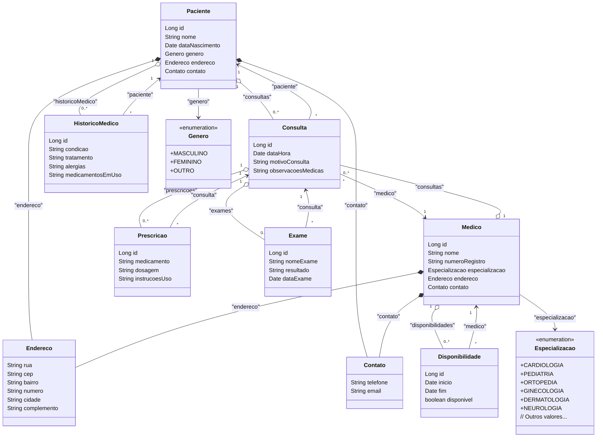

# Diagrama de Classes

Abaixo está o diagrama de classes representando todas as classes do sistema, utilizando a sintaxe do **Mermaid**. Este diagrama inclui todas as classes, seus atributos e os relacionamentos entre elas.

Você pode renderizar este diagrama utilizando ferramentas compatíveis com Mermaid, como extensões para VSCode, editores online como o [Mermaid Live Editor](https://mermaid.live/), ou diretamente em plataformas que suportam Mermaid.

## Explicação do Diagrama

- **Paciente**:
  - Contém informações pessoais e médicas do paciente.
  - Possui composição com as classes `Endereco` e `Contato`, indicando que essas informações estão embutidas na classe `Paciente`.
  - Relaciona-se com `HistoricoMedico` (1 para muitos) e `Consulta` (1 para muitos).

- **Medico**:
  - Armazena dados profissionais e de contato do médico.
  - Possui composição com `Endereco` e `Contato`.
  - Relaciona-se com `Disponibilidade` (1 para muitos) e `Consulta` (1 para muitos).
  - Usa a enumeração `Especializacao` para definir sua área médica.

- **Consulta**:
  - Representa uma consulta médica entre um paciente e um médico.
  - Relaciona-se com `Paciente` e `Medico` (muitos para um).
  - Possui relacionamentos com `Prescricao` e `Exame` (um para muitos).

- **Prescricao**:
  - Armazena informações sobre medicamentos prescritos durante uma consulta.
  - Relaciona-se com `Consulta` (muitos para um).

- **Exame**:
  - Registra exames solicitados em uma consulta.
  - Relaciona-se com `Consulta` (muitos para um).

- **HistoricoMedico**:
  - Mantém o histórico médico do paciente.
  - Relaciona-se com `Paciente` (muitos para um).

- **Disponibilidade**:
  - Gerencia os horários disponíveis de um médico.
  - Relaciona-se com `Medico` (muitos para um).

- **Endereco** e **Contato**:
  - Classes embutidas que armazenam informações de endereço e contato.
  - Utilizadas tanto por `Paciente` quanto por `Medico` através de composição.

- **Especializacao** e **Genero**:
  - Enumerações que definem especializações médicas e gêneros, respectivamente.
  - Utilizadas em `Medico` e `Paciente` como tipos de atributos.

## Como Interpretar o Diagrama

- **Classes**: Representadas como caixas contendo o nome da classe e seus atributos.
- **Relacionamentos**:
  - **Composição (\*--):** Indica que uma classe é parte integrante de outra (ex.: `Paciente` e `Endereco`).
  - **Agregação (o--):** Representa um relacionamento onde uma classe é uma coleção de outras (ex.: `Paciente` possui uma coleção de `Consulta`).
  - **Associação (--\>):** Indica que uma classe utiliza ou depende de outra (ex.: `Consulta` se associa a `Paciente`).
- **Multiplicidade**:
  - Os números próximos às setas indicam quantidades mínimas e máximas de objetos que participam do relacionamento (ex.: `Paciente "1" o-- "0..*" Consulta` significa que um paciente pode ter zero ou mais consultas).

## Observações

- As **enumerações** `Especializacao` e `Genero` estão representadas com o estereótipo `<<enumeration>>` e listam seus valores possíveis.
- As classes embutidas (`Endereco` e `Contato`) não possuem relações independentes no banco de dados; elas são incorporadas nas tabelas de `Paciente` e `Medico`.
- As setas direcionais indicam a navegabilidade e a dependência entre as classes, facilitando o entendimento dos fluxos de dados no sistema.

## Utilização do Diagrama

Este diagrama serve como referência para desenvolvedores e arquitetos entenderem a estrutura do sistema, as entidades envolvidas e como elas se relacionam. É uma ferramenta essencial para:

- **Desenvolvimento**: Auxilia na implementação correta das classes e seus relacionamentos.
- **Manutenção**: Facilita a identificação de componentes para correções ou melhorias.
- **Documentação**: Proporciona uma visão clara da arquitetura do sistema para novos membros da equipe ou partes interessadas.

---

Com este diagrama, você tem uma representação visual completa das classes e relações que compõem o sistema de gerenciamento de clínicas e hospitais, conforme detalhado nas seções anteriores.