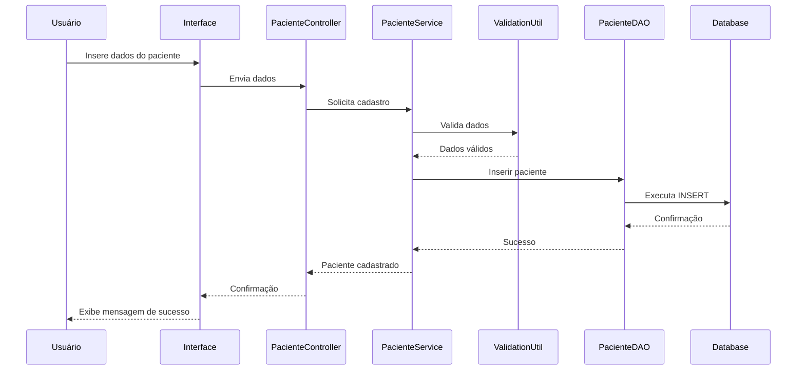
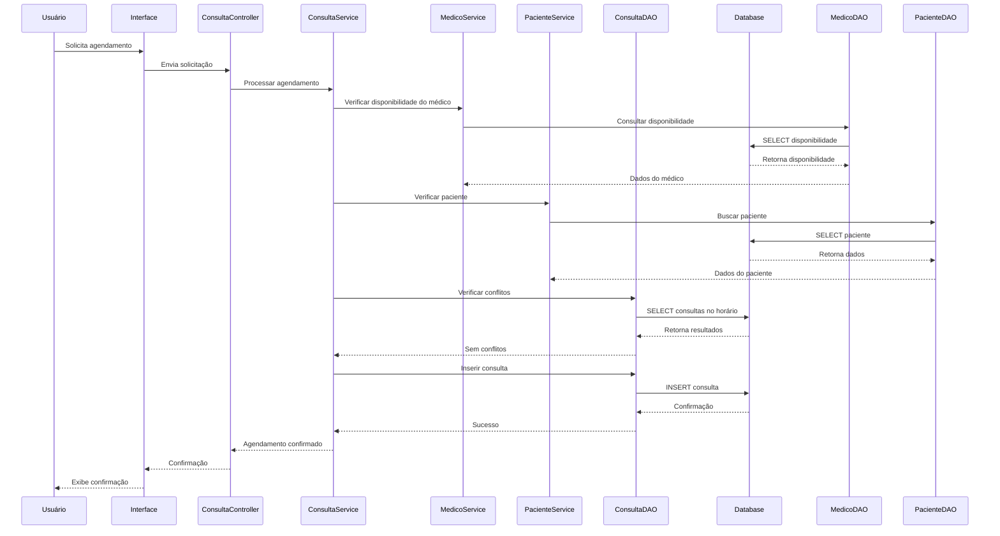
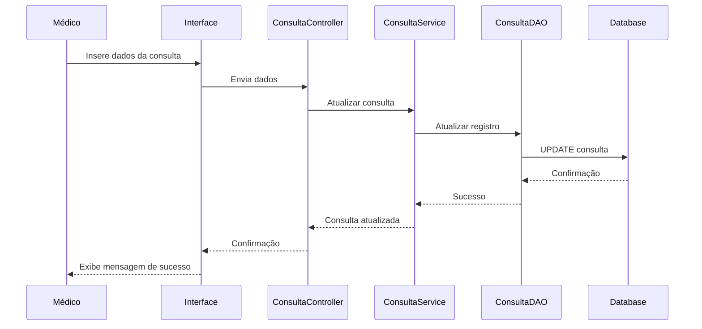
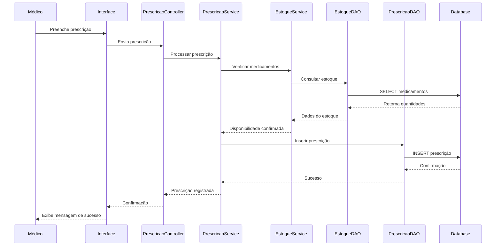
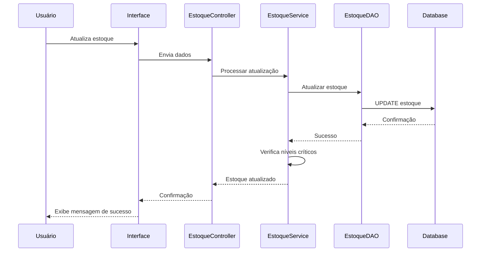
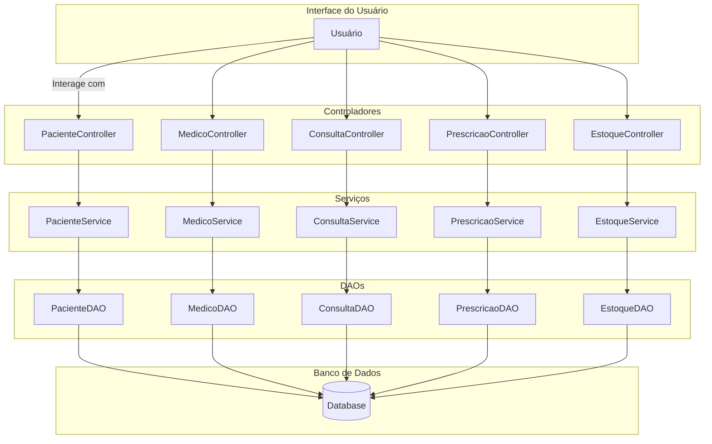

# 5. Fluxos de Dados - Diagramas Explicação

## Introdução

Nesta seção, apresentaremos os fluxos de dados principais do sistema de gerenciamento de clínicas e hospitais. Os diagramas ilustram como os dados fluem através dos diferentes componentes do sistema durante as operações críticas. Utilizaremos a Linguagem de Modelagem Unificada (UML) para representar esses fluxos, empregando o Mermaid para os diagramas, que podem ser renderizados diretamente em Markdown.

Os principais fluxos de dados que serão detalhados são:

- **Cadastro de Paciente**
- **Agendamento de Consulta**
- **Registro de Consulta Médica**
- **Emissão de Prescrição Médica**
- **Atualização de Estoque de Medicamentos**

---

## 5.1 Cadastro de Paciente

### Descrição do Fluxo

O fluxo de cadastro de paciente envolve a entrada de dados pessoais e médicos do paciente no sistema, que são então processados e armazenados no banco de dados. Esse processo garante que todas as informações relevantes estejam disponíveis para futuras consultas e tratamentos.

### Fluxo de Dados

1. **Usuário (Atendente/Recepcionista)**: Inicia o processo de cadastro fornecendo os dados do paciente através da interface do sistema.
2. **Interface do Usuário**: Coleta os dados inseridos e os envia para o `PacienteController`.
3. **PacienteController**: Recebe os dados e chama o `PacienteService` para processar o cadastro.
4. **PacienteService**: Valida os dados utilizando `ValidationUtil` e, em caso de sucesso, solicita ao `PacienteDAO` que persista as informações.
5. **PacienteDAO**: Interage com o banco de dados através do `DatabaseUtil` para inserir os dados do paciente.
6. **Banco de Dados**: Armazena as informações do paciente.
7. **Confirmação**: O fluxo retorna com a confirmação de sucesso ou mensagens de erro, que são apresentadas ao usuário.

### Diagrama de Fluxo de Dados

---

## 5.2 Agendamento de Consulta

### Descrição do Fluxo

O agendamento de consulta permite que pacientes marquem consultas com médicos disponíveis. O fluxo garante que não haja conflitos de horário e que o médico escolhido esteja disponível.

### Fluxo de Dados

1. **Usuário (Paciente/Atendente)**: Solicita o agendamento através da interface.
2. **Interface do Usuário**: Envia a solicitação para o `ConsultaController`.
3. **ConsultaController**: Recebe os dados e chama o `ConsultaService`.
4. **ConsultaService**: Verifica a disponibilidade do médico e do paciente, e valida os dados.
5. **ConsultaDAO**: Consulta o banco de dados para verificar conflitos de horário.
6. **Banco de Dados**: Retorna informações sobre agendamentos existentes.
7. **ConsultaService**: Confirma a possibilidade de agendamento e solicita ao `ConsultaDAO` que insira a nova consulta.
8. **ConsultaDAO**: Insere a consulta no banco de dados.
9. **Banco de Dados**: Armazena o agendamento.
10. **Confirmação**: O fluxo retorna com a confirmação do agendamento.

### Diagrama de Fluxo de Dados

---

## 5.3 Registro de Consulta Médica

### Descrição do Fluxo

Após a realização de uma consulta, o médico registra as informações relevantes, incluindo diagnósticos, procedimentos realizados e observações.

### Fluxo de Dados

1. **Usuário (Médico)**: Acessa o registro da consulta pela interface.
2. **Interface do Usuário**: Envia as informações para o `ConsultaController`.
3. **ConsultaController**: Recebe os dados e chama o `ConsultaService`.
4. **ConsultaService**: Valida as informações e atualiza o registro da consulta.
5. **ConsultaDAO**: Atualiza os dados da consulta no banco de dados.
6. **Banco de Dados**: Armazena as informações atualizadas.
7. **Confirmação**: Retorna a confirmação da atualização ao usuário.

### Diagrama de Fluxo de Dados

---

## 5.4 Emissão de Prescrição Médica

### Descrição do Fluxo

O médico emite uma prescrição para o paciente durante ou após a consulta. A prescrição é registrada no sistema e pode ser acessada posteriormente.

### Fluxo de Dados

1. **Usuário (Médico)**: Preenche a prescrição na interface do sistema.
2. **Interface do Usuário**: Envia os dados para o `PrescricaoController`.
3. **PrescricaoController**: Recebe os dados e chama o `PrescricaoService`.
4. **PrescricaoService**: Valida os dados e verifica o estoque dos medicamentos.
5. **EstoqueService**: Verifica a disponibilidade dos medicamentos prescritos.
6. **EstoqueDAO**: Consulta o banco de dados para verificar quantidades.
7. **Banco de Dados**: Retorna informações sobre o estoque.
8. **PrescricaoService**: Registra a prescrição no sistema através do `PrescricaoDAO`.
9. **PrescricaoDAO**: Insere a prescrição no banco de dados.
10. **Banco de Dados**: Armazena a prescrição.
11. **Confirmação**: Retorna a confirmação ao médico.

### Diagrama de Fluxo de Dados

---

## 5.5 Atualização de Estoque de Medicamentos

### Descrição do Fluxo

Quando medicamentos são consumidos ou recebidos, o estoque precisa ser atualizado para refletir as quantidades atuais e garantir que não faltem suprimentos essenciais.

### Fluxo de Dados

1. **Usuário (Farmacêutico/Responsável pelo Estoque)**: Realiza a entrada ou saída de medicamentos através da interface.
2. **Interface do Usuário**: Envia a informação para o `EstoqueController`.
3. **EstoqueController**: Recebe os dados e chama o `EstoqueService`.
4. **EstoqueService**: Processa a atualização do estoque.
5. **EstoqueDAO**: Atualiza as quantidades no banco de dados.
6. **Banco de Dados**: Armazena as novas quantidades.
7. **Alerta de Reposição**: Se necessário, o `EstoqueService` gera um alerta para reposição.
8. **Confirmação**: Retorna ao usuário a confirmação da operação.

### Diagrama de Fluxo de Dados

---

## 5.6 Fluxo Geral de Dados no Sistema

### Descrição do Fluxo

Este diagrama representa uma visão geral de como os dados fluem entre os principais componentes do sistema durante diversas operações.

### Diagrama de Fluxo de Dados Geral

---

## Conclusão

Os fluxos de dados apresentados demonstram como as informações percorrem o sistema desde a interação inicial do usuário até a persistência no banco de dados e retorno de confirmações ou resultados. A compreensão desses fluxos é essencial para:

- **Desenvolvedores**: Para manutenção, depuração e evolução do sistema.
- **Administradores de Sistemas**: Para otimização de desempenho e escalabilidade.
- **Usuários Finais**: Para entendimento de como suas ações impactam o sistema.

A modelagem clara dos fluxos de dados ajuda a garantir que todos os componentes do sistema trabalhem de forma harmoniosa, proporcionando um serviço eficiente e confiável.

